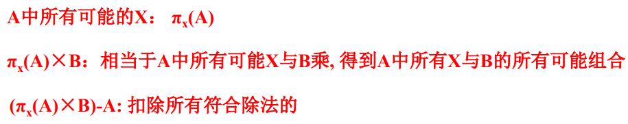
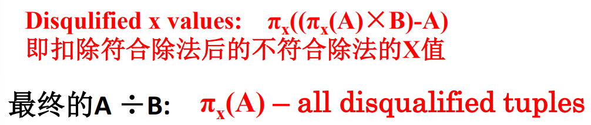
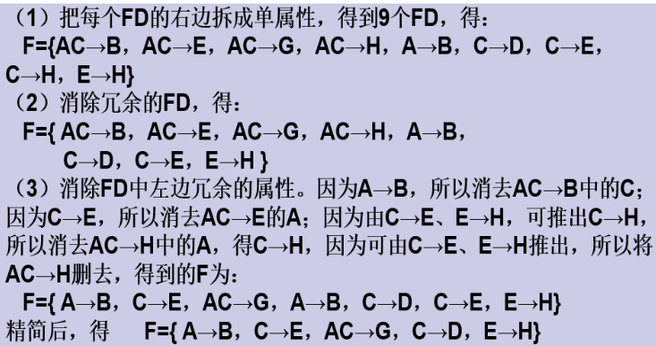

<a id="mulu">目录</a>
<a href="#mulu" class="back">回到目录</a>
<style>
    .back{width:40px;height:40px;display:inline-block;line-height:20px;font-size:20px;background-color:lightyellow;position: fixed;bottom:50px;right:50px;z-index:999;border:2px solid pink;opacity:0.3;transition:all 0.3s;color:green;}
    .back:hover{color:red;opacity:1}
    img{vertical-align:bottom;}
</style>

<!-- @import "[TOC]" {cmd="toc" depthFrom=3 depthTo=6 orderedList=false} -->

<!-- code_chunk_output -->

- [3.15](#315)
- [3.20](#320)
- [3.22](#322)
- [3.27/29](#32729)
- [4.3](#43)
- [4.7](#47)
- [4.10](#410)
- [4.19](#419)

<!-- /code_chunk_output -->

<!-- 打开侧边预览：f1->Markdown Preview Enhanced: open...
只有打开侧边预览时保存才自动更新目录 -->

### 3.15
考试要考关系运算--投影/除法等等
各种连接运算：先求笛卡尔积，然后选符合条件的行
笛卡尔积、自然连接、外连接：https://blog.csdn.net/u014395524/article/details/89420474
等值连接：https://blog.csdn.net/qq_40212930/article/details/88747786
除法详见[01new.md](./02作业/01new.md)
### 3.20
双重否定求除法？只在PPT上有--要考
A÷B：
{:width=80 height=80}
{:width=60 height=60}
有两个关系`R(X, Y)`，`S(Y, Z)`，除法就是计算哪些X值满足对应的Y包含S中Y的所有值。
https://blog.csdn.net/qq_44206313/article/details/105930672
***
元组/域关系演算--也可能要考？
有例子https://blog.csdn.net/qq_45109870/article/details/107864042
更多的例子https://blog.csdn.net/weixin_43934607/article/details/110210441
基本关系代数运算（选择、投影、并、差、笛卡尔积）https://blog.csdn.net/Yushan_Ji/article/details/134417831
***
全称和存在量词https://blog.csdn.net/weixin_45705907/article/details/105493693
***
数据库复习基本概念——关系、元组、属性、码、域、分量：
元组--表中的一行即为一个元组
分量--元组中的一个属性值
https://blog.csdn.net/XM_no_homework/article/details/104411865
### 3.22
9个关键词
表定义中的完整性约束条件在课本76/329，课件上无
{:width=500 height=170}
如果完整性约束条件涉及到该表的多个属性列,则必须定义在表级上,否则既可以定义在列级也可以定义在表级。
***
双重否定求除法的SQL代码--要考
`EXISTS`代表存在量词。带有`EXISTS`谓词的子查询不返回任何数据，只产生逻辑真值“true”或逻辑假值“false”--当括号内的查询结果不为空则返回true，反之为false
例：查询所有借阅了图书B0002的读者编号
```
SELECT rno
FROM reader
WHERE EXISTS
(
  SELECT*
  FROM lend
  WHERE mo = reader.rno AND bno ='B0002'
);
```
若内查询结果`SELECT*FROM lend WHERE rno=reader.rno AND bno='B0002'`为非空,则外层的`where`子句返回真值,否则返回假值。
从外层查询中reader表的第一个元组开始,若`WHERE`查询子句返回值为真(即内层查询非空),则取此元组放入结果表;依次检查reader表中的每一个元组,直至外层reader表全部检查完毕。
`NOT EXISTS`谓词与`EXISTS`谓词相对应。使用存在量词`NOT EXISTS`后,如果内层查询结果为空,则外层的`WHERE`子句返回真值,否则返回假值。
***
r/s表结构如下所示：
{:width=100 height=100}{:width=100 height=100}
```
-- R÷S的过程
select distinct R1.X from R R1 -- R1是R的别名
where not exists(	-- 不存在这个X对应的Y值
	select S.Y from S
	where not exists(	-- 这个Y值在S中没有对应的值
		select * from R R2
		where R2.Y=S.Y and R1.X=R2.X	-- 这句比较关键，把R和S联系起来
	)
);
```
输出：
{:width=100 height=100}
***
>学生表student (sno学号 sname姓名 Sdept所在系)
课程表Course (cno课程号 cname课程名)
学生选课表sc (sno学号 cno课程号 grade成绩)

例：找出选了所有课的学生的学号和姓名
即sc÷course结果向student中sno和sname的投影
```
select sno,sname from student
/*若没有有一门课是该学生没有选的，则代表选了所有课程*/
where not exists(
  /*含义是选出课程表中学生没有选的课程*/
  select course.cno from course
  where not exists(
    /*选择学生sno所选的全部课程*/
    select * from sc
    where sc.cno=course.cno and sc.sno=student.sno
  )
);
```
类比上面r/s，我们将sc作为r，course作为s，student作为结果投影表(r)，cno是rs的公共列(Y)，sno是r与结果投影表的连接列(X)，唯一区别是上面的结果投影表就是除数X
其中
```
select course.cno from course
where exists(
  select * from sc
  where sc.cno=course.cno and sc.sno=student.sno
)
```
是查询该学生的所选课程，而
```
select course.cno from course
where not exists(
  select * from sc
  where sc.cno=course.cno and sc.sno=student.sno
)
```
就是查询该学生没有选的课程，若这个结果为空，则代表该学生选了所有的课，此时
```
select sno,sname from student
where not exists(
  ...
)
```
中`not exists`返回true，将该学生放入结果中
### 3.27/29
函数依赖：自变量x唯一确定y，即当x取一定值，则y值也唯一确定。此时称Y函数依赖于X，记作X->Y（X可以唯一确定Y），此时X为决定属性组/决定因素。指关系中一个或一组属性值可决定其它属性的值。若X->Y且Y->X，则X<->Y
若X中元组属性值互不相同，X->Y一定成立
***
**平凡函数依赖**：X->Y且Y是X的子集，如（学号，姓名）->（姓名）、（学号，姓名）->（学号）
**非平凡函数依赖**：X->Y且Y不是X的子集，如如（学号，姓名）->（年级）
***
**完全函数依赖**(F)：X→Y, 且对于X的任一真子集X’，都有X’↛ Y，称Y对X有完全函数依赖
例：关系`R(学号，姓名，性别，班级，班主任，课程号，课程名，学时数，成绩)`
主键：学号+课程号
主属性：{学号，课程号}
非主属性有：{姓名，性别，班级，班主任，课程名，学时数，成绩}
成绩依赖于学号和课程号两个字段的组合；但只知道学号无法确定成绩，同理只知道课程号也无法确定成绩；只有学号和课程号组合在一起才能标识哪个学生哪门课程的成绩；
因此`(学号,课程号)---->成绩`是“完全函数依赖”。
**部分函数依赖**(P)：X→Y,但Y不完全函数依赖于X，称Y对X部分函数依赖
姓名、性别和班级三个属性只依赖于主键中的学号，与“课程号”无关，因此
- `(学号,课程号)---->姓名`是“部分函数依赖”
- `(学号,课程号)---->性别`是“部分函数依赖”
- `(学号,课程号)---->班级`是“部分函数依赖”

课程名和学时数只依赖于课程号，因此`(学号,课程号)---->课程名`是“部分函数依赖”
***
**传递函数依赖**(T)：如X→Y， Y→Z，Z ∉ Y, Y ∉ X, Y ↛ X, XY与Z无交集， 称Z对X传递函数依赖
班主任依赖于班级，与学号无关，与课程号也无关，又因班级依赖于学号所以班主任间接依赖于学号，因此，`(学号,课程号)---->班主任`是“传递函数依赖”
**直接函数依赖**(D)：X←→Y， Y→Z，Z ∉ Y，  Y ∉ X, Z ∉ X， Y ∉ Z，则Z直接依赖于X（D没有资格传递）
{:width=200 height=200}
***
求闭包--可能要考
F为关系R的函数依赖集，被F逻辑蕴含的所有函数依赖组成的集合称为F的闭包，记作F^+^
如果有F={X→A1，X→A2t，……X→An}, 则至少可推出2^n^个不同的函数依赖
https://blog.csdn.net/weixin_43217572/article/details/105183181
https://blog.csdn.net/zhang1213885531/article/details/80961983
设有关系模式R(U，F)，求关于U上的函数依赖集F的闭包(X)^+^
U=`{A，B，C，D，E，I}`，F=`{A→D，AB→E，BI→E，CD→I，E→C}`,X=`AE`
**1.** 令X(0)=X=AE
**2.** 在F中寻找左边是AE的**子集**的函数依赖：`A→D，E→C`，则X(1)就等于`X(0)`∪`A→D，E→C`中的右侧字母，即X(1)=`X(0)`∪`DC`=`ACDE`
**3.** 比较X(0)与X(1)，若相等，结果就是它们
**4.** 在F中寻找**尚未使用过的**左边是X(1)子集的函数依赖：`CD→I`，则X(2)就等于`X(1)`∪`CD→I`中的右侧字母，即X(2)=`X(1)`∪`I`=`ACDEI`
**5.** 继续比较X(1)与X(2)，不等就重复第4、5步，相等则结果就是它们
**6.** 虽然X(2)≠X(1)，但F中已经没有**尚未使用过的**左边是X(2)子集的函数依赖，所以不必再计算下去，即(AE)^+^=`ACDEI`

在比较X(i)与X(i+1)的过程中，若X(i+1)==U，则也可以直接出结果为U
### 4.3
函数依赖集F满足:
- F中任一函数依赖的右部仅含有一个属性
- F中的函数依赖均不能由F中的其他函数依赖导出
- F中各函数依赖左部均为最小属性集

则F是最小函数依赖集，**不唯一**，与对各函数依赖及X→Y中X各属性的处置顺序有关
求最小函数依赖集：
1. 先将右边都变成单属性
2. 依赖集中不能出现冗余的函数依赖（重复的函数依赖）
3. 左边没有多余的属性
4. 把左边相同的属性合并，如`A->B,A->C`合并为`A->BC`

**例1：**
{:width=80 height=80}
1. 将右边都变成单属性：
   `A->BC,B->C,A->B,AB->C`在这些函数依赖中只有`A->BC`右边不是单属性，所以将它变成单属性就是`A->B,A->C`。
   所以现在有以下这些函数依赖`A->B,A->C,B->C,A->B,AB->C`，去掉重复的两个`A->B`，现在的函数依赖为`A->B,A->C,B->C,AB->C`
2. 去掉冗余的函数依赖：
  从`A->B,B->C`可以推出`A->C`，所以去掉`A->C`，现在的函数依赖为`A->B、B->C、AB->C`
3. 左边没有多余的属性:
  在上面得到的函数依赖中，左边有两个属性的是`AB->C`,又因为左边的属性中的B存在这样的关系`B->C`，所以A多余，`AB->C`等效于`B->C`，删去

得到最小的函数依赖集为`A->B,B->C`
总结：在将右边都变成单属性后，
- 由`A->B B->C`消去结果中的`A->C`（原`A->B B->C`不能删除）
- 将`A->B AC->B`直接变成`A->B`
- 将`A->B AB->C`直接变成`A->B A->C`
- `A->B B->A`保留

最后去重
如何判断左边是否有冗余，以`AB->C`为例：
求闭包A^+^，若其中包含C，则B冗余，直接将`AB->C`->`A->C`
***
**例2：**
{:width=80 height=80}
{:width=250 height=250}
其中第二步中因为`C->E,E->H`，所以删掉`C->H`

判断是不是最小依赖集：对给定的F，进行上面求最小依赖集的操作，如果没有需要更改的项，就是最小依赖集
### 4.7
第n范式：https://blog.csdn.net/WHEgqing/article/details/108997240
1NF：每个分量（属性）都不可分
2NF：每个非主属性都完全函数依赖于任何一个候选码
3NF：不存在传递依赖（码X→属性Y,属性Y→非主属性Z），即每个非主属性既不部分依赖也不传递依赖于候选码 
BCNF范式：当X→Y且Y∉X时，X必含有码（候选码）；或者说不存在主属性对于码的部分函数依赖。用于解决多候选码间依赖的问题
4NF：消除非平凡且非函数依赖的多值依赖
5NF：消除不是由候选码蕴涵的连接依赖
***
某公司有若干个仓库；每个仓库只能有一名管理员，一名管理员只能在一个仓库中工作；
得到函数依赖集`仓库名 → 管理员,管理员 → 仓库名,(仓库名，物品名) → 数量`，主属性为`仓库名`、`管理员`、`物品名`
可以看到，`仓库名`和`管理员`相互决定，主码可以为`(管理员,物品名)`或`(仓库名,物品名)`，存在着某个主属性`仓库名`对于码`(管理员,物品名)`的部分函数依赖（或传递函数依赖），不符合BCNF范式
所以说BCNF解决了多个候选码间的依赖问题，被称为修正的第3范式->**3NF不一定是BCNF，但BCNF一定是3NF**
解决办法：
```
仓库（仓库名，管理员）
库存（仓库名，物品名，数量）
```
求候选码（可能考）：https://blog.csdn.net/Env1sage/article/details/118408226
左右两侧都没出现的、只出现在左边的一定包括在候选码中，只出现在右边的一定不是。若此时的候选码的闭包包括所有元素就结束，反之则逐个添加左右两侧都出现的元素，求闭包直到包括所有元素
模式分解：https://blog.csdn.net/sumaliqinghua/article/details/86246762
先求最小函数依赖集，将左右两侧都没出现的元素单独成一个子集，剩下的依赖集合即为结果（`{A->B,B->C}`->`{AB}{BC}`），此时的结果为保函数依赖的结果。若要求出无损的结果，就求出候选码集合加到结果中。最后还要去除重复的（如BD是BCD子集就去除）
判断这个分解是否具有无损连接性：https://blog.csdn.net/dyyay521/article/details/111874768
画完表格后，开始更表格，若读取到A->B，就先找有没有AB列都是a的行，如果有，就将B列的值都改成a；如果没有，就将所有含A的行的B列改成b
### 4.10
画E-R图--要考
例：一个企业的数据库需要存储如下信息。**职工**:`职工号,工资,电话`，**部门**:`部门号,部门名,人数`，**职工子女**:`姓名,年龄`
职工在部门工作。每个部门由一个职工管理。当父母确定时，其孩子的名字是唯一的。一旦父母离开该企业，孩子的信息也不保存。
根据以上信息，画出E-R图。
{:width=300 height=300}
若还要在**职工**中添加`技能`的多值属性，就是
{:width=300 height=300}
注意：`技能`是多值属性，所以用两个圆；而职工不一定管理部门，所以`部门-管理`的连线应为非强制存在
### 4.19
E-R图向关系模型的转换（3种情况）
https://blog.csdn.net/qq_41706331/article/details/91467961