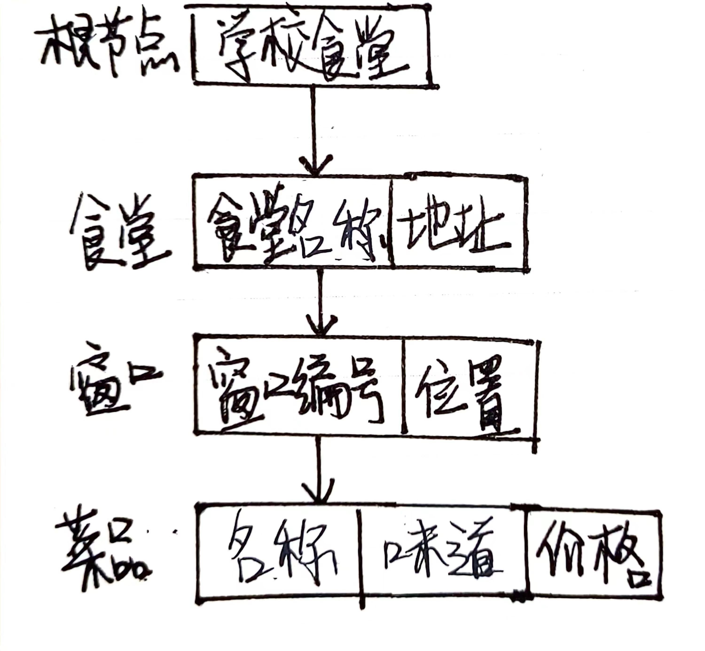
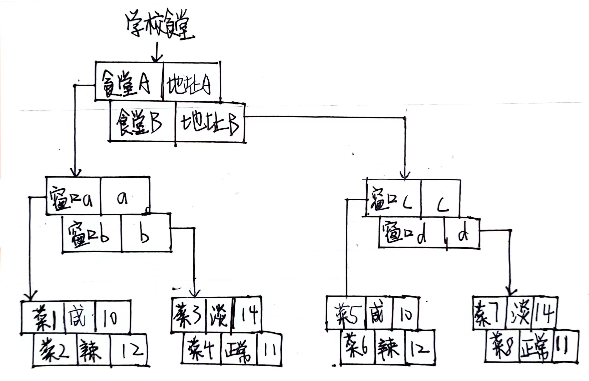
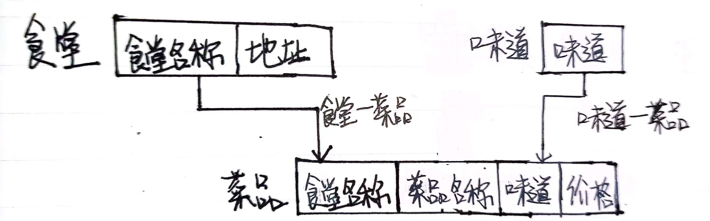
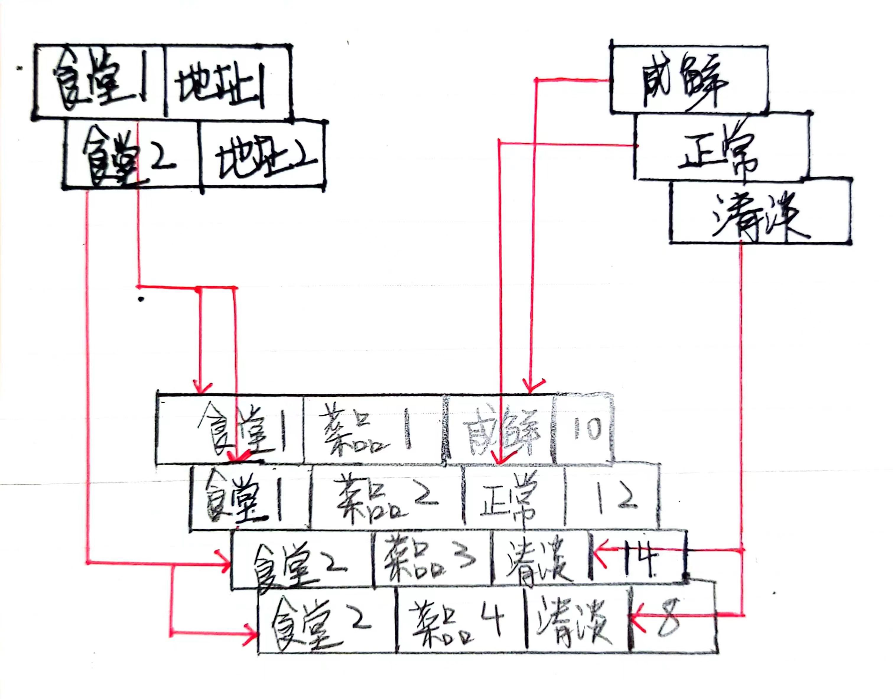

#### 层次模型
按照**食堂->窗口->菜品**的顺序：
{:width=200 height=200}
例：
{:width=300 height=300}
#### 网状模型
一个食堂可以有若干种菜品，多种菜品可以对应相同的口味（一种口味可以对应若干种菜品）：
{:width=120 height=120}
例：
{:width=250 height=250}
#### 关系模型
设置基本**属性**：菜品名称、所在食堂、所在窗口、口味、价格。
同时需要一个**码**来唯一确定一元组，采用数字编号的方式：食堂编号+窗口编号+菜品编号，如`010203`代表编号为`01`的食堂的`02`窗口的`03`菜品。
可以构建菜品表：
菜品(菜品编号, 菜品名称, 所在食堂, 所在窗口, 口味, 价格)
***
例：
| 菜品编号 | 菜品名称 | 所在食堂 | 所在窗口 | 口味 | 价格 |
| -------- | -------- | -------- | -------- | ---- | ---- |
| 010101   | 菜品A    | a        | 1        | 清淡 | 10   |
| 021203   | 菜品G    | b        | 12       | 正常 | 11   |
| 030710   | 菜品Z    | c        | 7        | 较辣 | 12   |
| ...      |