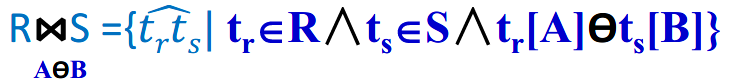

#### 第三章课后题
1. **关系模型的三个组成部分**：关系数据结构、关系操作集合和关系完整性约束
2. **一些概念**：
   1. **笛卡尔积**：给定一组域`D1,D2,...,Dn`（允许其中某些域或全部域相同），定义`D1,D2,...,Dn`的笛卡尔积为`D1×D2×…×Dn={(d1,d2,...,dn)｜di∈Di，i=1,2,...,n}`，也就是**所有域中的元素排列组合出来的所有可能的元组集合**。
   2. **主码**：若关系某一属性组的值能唯一标识一个元组，则称该属性组为候选码。若一个关系有多个候选码，则选定其中一个为主码。
   3. **候选码**：若关系某一属性组的值能唯一标识一个元组，则称该属性组为候选码。
   4. **外码**：若关系模式R的某属性集是另一个关系模式S的主码，则该属性集为关系模式R的外码。
   5. **关系**：`D1×D2×...×Dn`的子集叫域`D1,D2,...,Dn`上的关系，表示为`R(D1,D2,...,Dn)`，其中R为**关系名字**，n为**关系的目或度**`degree`，`n=1`--单元或一元关系，`n=2`--二元关系。
   6. **关系模式**：是关系的框架，也称关系的型，相当于表记录的格式；是关系的描述，可确定关系的二维表的形式。是一个五元组, 表示为`R(U,D,DOM,F)`，其中R为关系名，U为属性名集合，D为属性所来自的域，DOM为属性向域的映像集合，F为属性间数据的依赖关系集合。
   7. **关系数据库**：在关系模型中，实体以及实体之间的联系都是通过关系来表示的。因此，在一个给定的应用领域中，所有实体以及实体之间的联系所对应的关系的集合就构成一个关系数据库。
3. **关系数据库的三个完整性约束**：
   1. **实体完整性**：若属性(一个或一组属性)A是基本关系R的主属性，则A不能取空值(“不知道”或“不存在”的值)。
   2. **参照完整性**：若属性(或属性组)F是基本关系R的外码，它与基本关系S的主码K~S~相对应(基本关系R与S不一定是不同的关系)，则对于R中每个元组在F上的值必须为：
      - 或取空值(F的每个属性值均为空值)；
      - 或等于S中某个元组的主码值。
   3. **用户自定义完整性**：针对某具体关系数据库的约束条件，某具体应用某数据必须满足语义要求。
4. **连接运算**：包括内连接(INNER)、全外连接(FULL OUTER)、左外连接(LEFT OUTER)、右外连接(RIGHT OUTER)和交叉连接(CROSS)，最重要的是**等值连接**(相等连接)和**自然连接**(Natural join)。
   **等值和自然连接的区别**：等值连接是从关系R和S的笛卡尔积中选取关系A和关系B属性值相同的那些元组；自然连接是一种特殊的等值连接，它要求两个关系中进行比较的分量必须是相同的属性组，并且在结果中把重复的属性列去掉。
5. **对参与并、交、差运算的两个关系R、S有什么要求?**
   必须满足相同个数属性且类型相同，其相应的属性取自同一个域。
6. **关系代数运算可分为**：传统的集合运算（交、并、差和笛卡尔积运算）和专门的关系运算（选择、投影、连接和除运算）
   1. **并**：关系R与S的并--{:width=30 height=30}
   即将R，S元组放一起，消除重复元组。
   2. **差**：关系R与S的差--从R中去除与S相同的元组，结果仍为n目关系，由属于R而不属于S的所有元组组成{:width=30 height=30}
   3. **交**：关系R与S的交--由属于R又属于S的所有元组组成{:width=30 height=30}
   4. **笛卡尔积**：也称直积，即两个表中的每一行数据任意组合。设关系R（n目）和S（m目）的笛卡尔积{:width=30 height=30}
   5. **选择**：在R中找满足给定谓词F(即选择条件)的所有元组，记作：{:width=50 height=50}
   6. **投影**：实际是删除不在投影列表中的属性，或选关系R中所需列组成一新关系，记作：{:width=100 height=100}
   7. **连接**：
   {:width=50 height=50}
   A和B分别为R和S上列数相同且可比的属性组。ϴ是比较运算符。从笛卡尔积`RXS`中选R在A属性组上值与S在B属性组上值满足比较关系的元组。
   8. **除**：
   {:width=30 height=30}
    `R÷S`得到新关系P(X) ，P是R中满足下列条件的元组在X属性上的投影：R中的元组在X上的分量值x的像集Yx包含S在Y上投影的集合。
    R中的Y与S中的Y可以有不同属性名，但必须出自相同域集。
7. **关系运算的应用**：
{:width=600 height=600}
#### 关于除法运算
像集：求x1在表A中的象集，就是先选出所有x属性中x=x1的那些行，然后选择出不包含x1的那些列

得到

***
投影：X在AB列上的投影，就是选X的AB列组成一个新表

得到

***
X÷Y：其中X有ABC列，Y有BCD列
求A列中各值在X中的像集，再求Y在BC上的投影，看谁的像集包含全部的投影

***
另一个例子：

A÷B--本质是求哪些人名，借的书同时包含书号1和2
- 求表A中各个不同x对应的象集
  {:width=400 height=300}
- 找出表B中与A属性相同的那些列，此时可以看出书号一列是相同的，所以把这一列抽出来（求投影）
  {:width=130 height=100}
- 谁的像集包含所有的投影
  {:width=100 height=80}
#### 学生选菜关系
根据三个关系：
- 学生`Student(sno,sname,sex,hometown)`
- 学生选单`Sm(sno,fno)`
- 菜品`Fm(fno,fname,fprice,cantname)`

构建关系模型如下：
{:width=120 height=120}
这样只要避免了重复存储学生的姓名、性别和菜品的价格、名称等详细信息。
只要知道Sm表，就可以通过sno和fno去Student和Fm表中查找，避免了空间的浪费，同时保证了查找的准确性和速度。