<a id="mulu">目录</a>
<a href="#mulu" class="back">回到目录</a>
<style>
    .back{width:40px;height:40px;display:inline-block;line-height:20px;font-size:20px;background-color:lightyellow;position: fixed;bottom:50px;right:50px;z-index:999;border:2px solid pink;opacity:0.3;transition:all 0.3s;color:green;}
    .back:hover{color:red;opacity:1}
    img{vertical-align:bottom;}
</style>

<!-- @import "[TOC]" {cmd="toc" depthFrom=3 depthTo=6 orderedList=false} -->

<!-- code_chunk_output -->

- [数据定义语句](#数据定义语句)
    - [操作数据库](#操作数据库)
    - [操作表](#操作表)
- [数据操作语句](#数据操作语句)
    - [添加行](#添加行)
    - [删除行](#删除行)
    - [修改行](#修改行)
- [数据查询语句](#数据查询语句)
    - [基础关键字](#基础关键字)
    - [排序查询](#排序查询)
    - [分组查询与聚合函数](#分组查询与聚合函数)

<!-- /code_chunk_output -->

<!-- 打开侧边预览：f1->Markdown Preview Enhanced: open...
只有打开侧边预览时保存才自动更新目录 -->

### 数据定义语句
##### 操作数据库
```
create database db1; --创建库
create database if not exists db1; --创建库是否存在，不存在则创建
show databases; --查看所有数据库
show create database db1; --查看某个数据库的定义信息
alter database db1 character set utf8; --修改数据库字符信息
drop database db1; --删除数据库
```
##### 操作表
```
--创建student表，包含int型的id列、字符型的name列...
create table student(
    id int,
    name varchar(32),
    age int ,
    score double(4,1),
    birthday date,
    insert_time timestamp
);
desc 表名; --查看表结构
show create table 表名; --查看创建表的SQL语句
alter table 表名 rename to 新的表名; --修改表名
alter table 表名 add 列名 数据类型; --添加一列
alter table 表名 drop 列名; --删除列
drop table 表名; --删除表
drop table if exists 表名; --删除表是否存在，存在则删除
```
例：
```
create database test; --创建test数据库
use test; --使用test数据库，之后创建表都是在这个数据库中
create table student(
    id int,
    name varchar(32),
    age int ,
    score double(4,1),
    birthday date,
    insert_time timestamp
); --创建列
alter table student drop insert_time; --删除列
```
### 数据操作语句
##### 添加行
```
-- 写全所有列名
insert into 表名(列名1,列名2,...列名n) values(值1,值2,...值n);
-- 不写列名（所有列全部添加）
insert into 表名 values(值1,值2,...值n);
-- 插入部分数据
insert into 表名(列名1,列名2,...) values(值1,值2,...);
```
例：
```
use test;
insert into student(id,name,age) values(1,"abc",18);
insert into student values(2,"bcd",19);
insert into student(id,name) values(3,"cde");
```
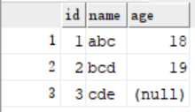{:width=80 height=80}
##### 删除行
```
delete from 表名 where 列名=值(或其它条件语句); --删除表中数据
delete from 表名; --删除表中所有数据，保留列名
truncate table 表名; --删除表中所有数据（比上面的方法更高效），保留列名
```
例：
```
use test;
delete from student where name="abc";
```
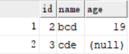{:width=80 height=80}
##### 修改行
```
update 表名 set 列名 = 值; --不带条件的修改(会修改所有行)
update 表名 set 列名 = 值 where 列名=值; --带条件的修改
```
例：
```
use test;
update student set age=20 where age is null; --将age为空的行的age列值设为20
update student set id=0; --将所有行的id设为0
```
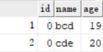{:width=80 height=80}
### 数据查询语句
##### 基础关键字
`and`与`or`：&&与||
`between n and m`：n≤数据≤m
`in(a,b,c,...)`：数据==a或b或c...
`is not null`：不为null值
`like "_%"`：模糊查询，其中`_`表示单个任意字符，`%`表示多个任意字符（≥0个）
`distinct`：去除重复值，`SELECT DISTINCT 列名称 FROM 表名称`
```
-- 查询年龄大于等于20且小于等于30的行				
SELECT * FROM student WHERE age >= 20 && age <= 30;
SELECT * FROM student WHERE age >= 20 AND age <= 30;
SELECT * FROM student WHERE age BETWEEN 20 AND 30;
-- 查询年龄22岁，18岁，25岁的行
SELECT * FROM student WHERE age = 22 OR age = 18 OR age = 25
SELECT * FROM student WHERE age IN (22,18,25);

SELECT * FROM student WHERE english IS NOT NULL; --查询英语成绩不为null的行
SELECT * FROM student WHERE NAME LIKE '马%'; --查询姓马的有哪些？
SELECT * FROM student WHERE NAME LIKE "_化%"; --查询姓名第二个字是化的人			
SELECT * FROM student WHERE NAME LIKE '___'; --查询姓名是3个字的人				
SELECT * FROM student WHERE NAME LIKE '%德%'; --查询姓名中包含德的人
SELECT DISTINCT NAME FROM student; --获取姓名列的值（同时去重）
```
例：对于表
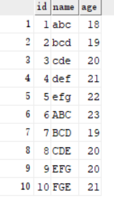{:width=200 height=200}
```
select * from student where age between 18 and 19;
```
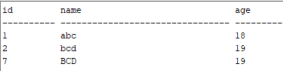{:width=80 height=80}
```
select * from student where age in (18,21,22);
```
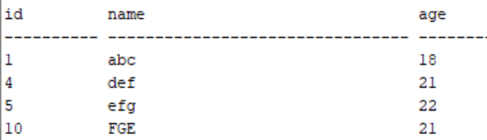{:width=80 height=80}
```
--查询包含c的name
select name from student where name like "%c%"; --abc bcd cde ABC BCD CDE（因为不区分大小写）
--查询第一个字符为b的name
select name from student where name like "b%"; --bcd BCD
--查询name列取值（去重后）
select distinct name from student; --abc bcd cde def efg FGE
```
##### 排序查询
`order by 排序字段1 [排序方式1] [,排序字段2 [排序方式2]...]`
如果有多个排序条件，则当前边的条件值一样时，才会判断第二条件。
例：
```
select * from student order by age; --默认从小到大（升序）
```
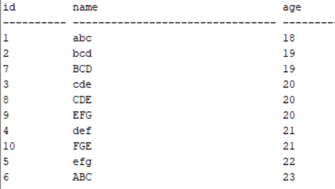{:width=150 height=150}
```
select * from student order by age desc; --降序
```
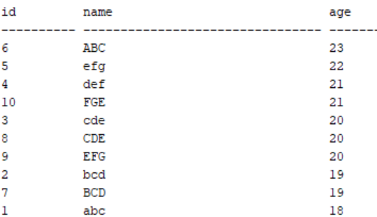{:width=150 height=150}
##### 分组查询与聚合函数
分组查询：`group by 分组字段`
聚合函数：将一列数据作为一个整体，进行纵向的计算，包括：
- count：计算个数，如`count(列名)`，下同
- max：计算最大值
- min：计算最小值
- sum：计算和
- avg：计算平均数

通常它们一起使用：`select 分组字段, 聚合函数1 [聚合函数1列名],聚合函数2 [聚合函数2列名],... from 表名 group by 分组字段`，如果select后不加分组字段，就无法直观显示哪个聚合函数结果对应哪组。
例：对于表
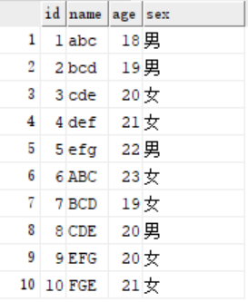{:width=200 height=200}
```
--按性别分组，分别计算每组年龄的平均值
select sex,avg(age) from student group by sex;
```
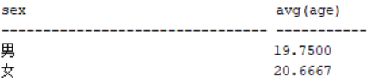{:width=50 height=50}
如果只写`select avg(age) ...`，结果中就只有avg一列，看不出是哪组的avg。
```
--按性别分组，要求age≤19的人不参与分组，计算每组人数以及age的最大值
select sex,max(age),count(id) from student where age>19 group by sex;
```
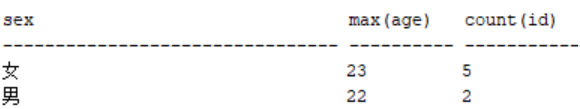{:width=60 height=60}
其中`count(id)`换成`count(age)`或`count(name)`也可以（每个人都有1个id/age/name）
```
--按性别分组，计算每组人数以及age的最大值（并将结果列重命名）
select sex,max(age) 年龄最大值,count(id) 人数 from student group by sex;
```
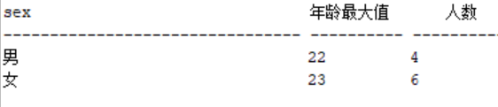{:width=60 height=60}
```   
--按age分组，每组应至少有2人，只有1人的组被忽略，计算每组的人数
select age,count(id) from student group by age having count(id)>1;
--也可以写成
select age,count(id) 人数 from student group by age having 人数>1; --这里把count(id)的结果列命名为“人数”
```
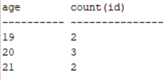{:width=80 height=80}
其中`HAVING`子句紧跟在`GROUP BY`子句之后，它的作用是添加过滤条件针对分组统计结果后的数据进行筛选